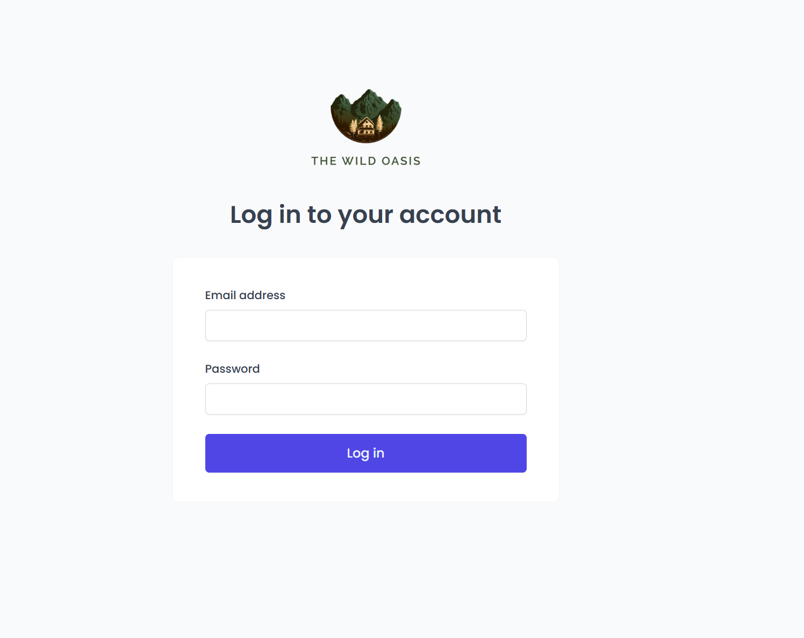
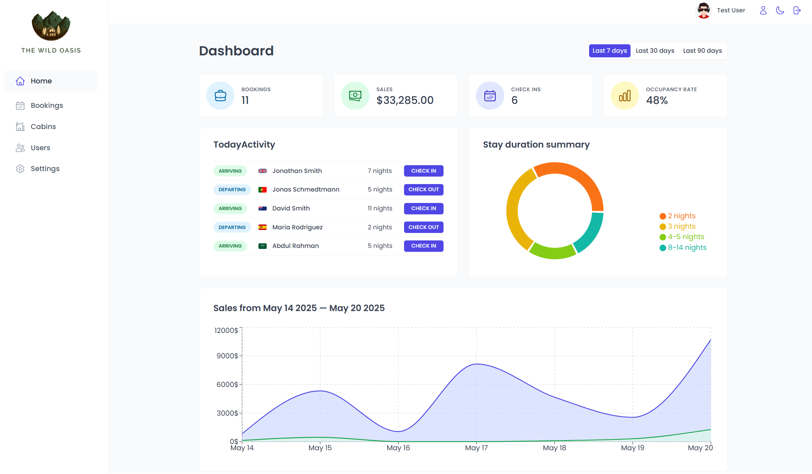
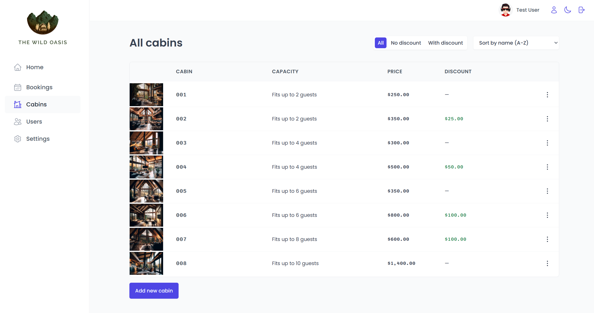
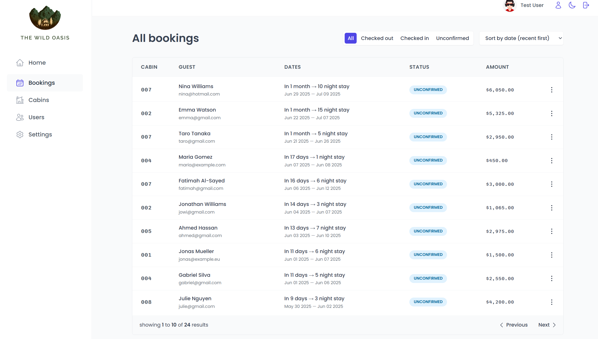
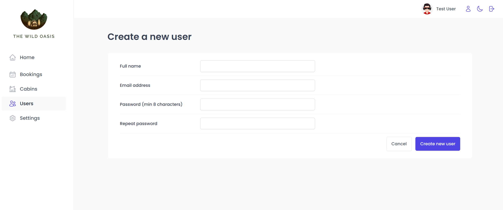
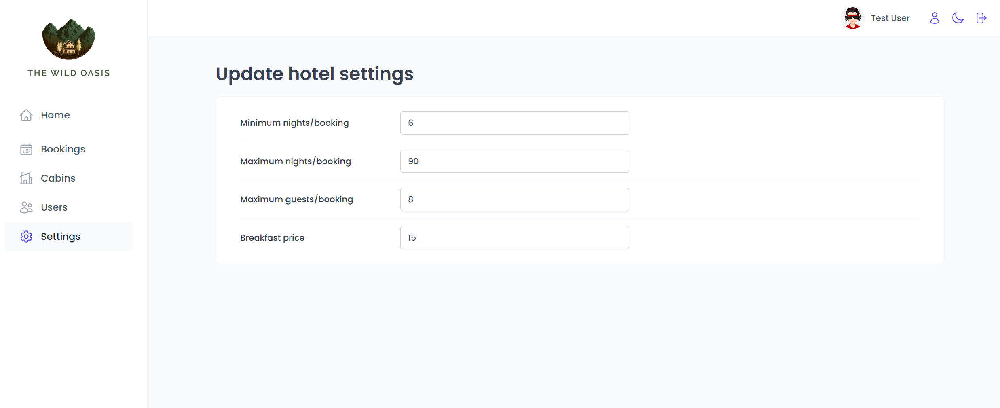
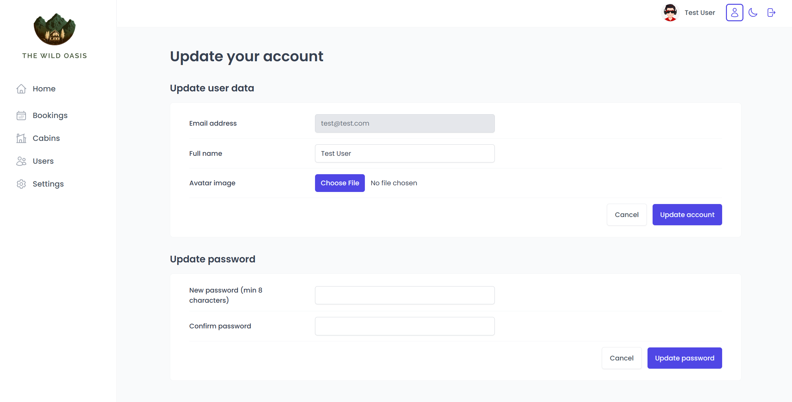

# 🌴 The Wild Oasis – Hotel Management Web App

**The Wild Oasis** is a sleek and user-friendly hotel management application built to handle everything from bookings and cabin listings to user roles and real-time dashboards. This project showcases strong expertise in **JavaScript**, **TypeScript**, **React**, and **database integration**, all wrapped in a responsive and modern UI.

🔗 **Live Demo**: [the-wild-oasis-ishwor.netlify.app](https://the-wild-oasis-ishwor.netlify.app/)  
🧪 **Demo Login**: `test@test.com` / `test1234`

---

## 🧠 Motivation

> _"The best way to learn is by building something real."_

This project was a deep dive into full-stack development where I sharpened my skills in:

- ⚛️ React architecture & component design
- 🔐 Authentication and role-based access
- 📊 Dynamic dashboards & state management
- 🗃️ Efficient database querying & API handling
- 🧩 Clean, modular code structure

By building **The Wild Oasis**, I turned complex concepts into practical, hands-on experience.

---

## 📸 Screenshots

### 🔐 Login Page



### 📊 Dashboard



### 🛏️ Cabins Page



### 📘 Bookings Page



### 🧑‍💼 Create User



### ⚙️ Settings Page



### 📝 Update Account



## ✨ Key Features

### 🔐 Authentication & Authorization

- Secure login for hotel staff only
- Avatar upload and profile management
- Password and name change

### 🏕️ Cabin Management

- View, create, update, delete cabins
- Includes cabin photo, name, capacity, price, and discount

### 📅 Booking Management

- Table view of bookings with status: Unconfirmed / Checked-in / Checked-out
- Track number of nights, guests, breakfast, payment status
- Add breakfast during check-in if not pre-booked

### ✅ Check-In / Check-Out

- Fast check-in/out with optional breakfast
- Accept payment manually and update status in app

### 🧍 Guest Management

- Guest data includes full name, email, ID, nationality, and flag

### 📊 Dashboard Insights

- View check-ins and check-outs of the day
- Stats for last 7, 30, or 90 days (sales, occupancy, bookings)
- Sales & duration charts (built with `recharts`)

### ⚙️ App Settings

- Control breakfast price, min/max nights, max guests
- Toggle light/dark mode

---

## 💻 Tech Stack

**Frontend**

- `React`, `TypeScript`, `React Router`, `Redux`
- `@tanstack/react-query` – for async data handling
- `styled-components` – CSS-in-JS for styling
- `react-hook-form`, `react-hot-toast`, `react-icons`

**Backend & DB**

- `Supabase` – authentication + PostgreSQL database
- `Node.js`, `Express.js` – for any backend extensions

**Other**

- `date-fns` – for date formatting
- `recharts` – to create elegant charts

---

## 🛠️ Installation Steps

1. **Clone the repo**

```bash
git clone https://github.com/it-is-it/the-wild-oasis.git
cd the-wild-oasis
```

2. **Install dependencies**

```bash
npm install
```

3. **Run the app**

```bash
npm run dev
```

4. **Visit the app at**

```
http://localhost:5173
```

---

## 🧱 Project Structure

```
/src
├── components     # Reusable UI components
├── features       # Business logic like bookings, guests, settings
├── services       # Supabase config and API utilities
├── hooks          # Custom hooks
├── styles         # Global styles and themes
└── pages          # Page-level components (e.g., Dashboard, Login)
```

---

## 🪴 Future Improvements

- [ ] Enable PWA support
- [ ] Add featured and recently viewed tours
- [ ] UX & UI improvements
- [ ] Add better error handling and logging

---

## 🐛 Known Bugs

Please feel free to contact me for any issues or improvements.

---

## 🧑‍💻 Author

**Ishwor Timalsina**
